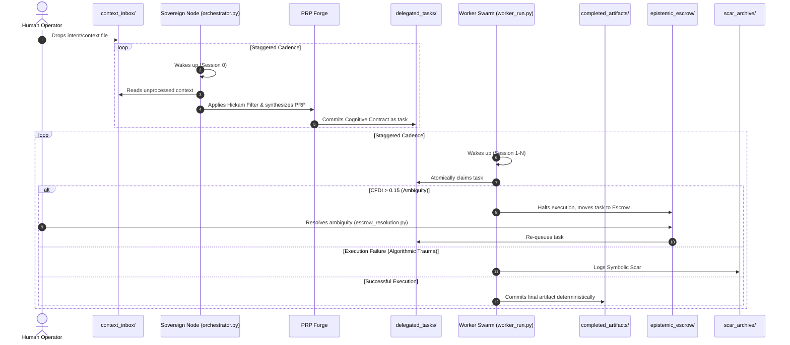

# TIER 3: CI/CD Pipeline Cartograph

AST-to-YAML Reverse Trace complete. Temporal Flow: Left → Right = Context → Execution.
⚠️ Items in RED are Nominative Traps or Orphaned Nodes.

**Nominative Traps:**
Currently, there is no explicit `.github/workflows/` defined for CI/CD. The execution pipeline relies entirely on the staggered invocation of `orchestrator.py`.
