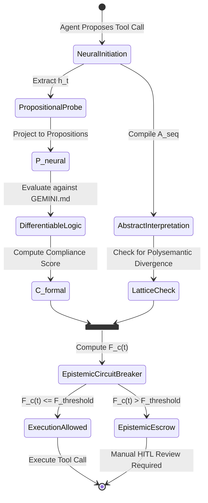

# Engineering a Hybrid Neuro-Symbolic Gatekeeper using Differentiable Logic Programming and Abstract Interpretation for Zero-Trust Tool Execution

## 1. The Propositional Probe Module

The Propositional Probe Module extracts latent activations $h_t$ from the model's forward pass during the generation of a tool-call sequence. It projects these activations onto a set of logical propositions $P = \{p_1, p_2, \dots, p_k\}$ representing the agent's internal safety beliefs.

This is formalized as a learned projection function $f_\theta: \mathbb{R}^d \rightarrow [0, 1]^k$:
$$P_{neural} = \sigma(W_{probe} h_t + b_{probe})$$
Where $\sigma$ is the sigmoid function, mapping activations to probabilities of safety propositions holding true.

## 2. Differentiable Logic Programming

We evaluate $P_{neural}$ against an immutable, declarative policy-as-code ledger (the Supreme Law layer of GEMINI.md). We employ a continuous logic relaxation (e.g., product logic or Łukasiewicz logic) to make the evaluation differentiable.

Let $\Phi$ be the set of rules in the policy ledger. We compute the continuous truth value of compliance $C_{formal}$ using Deep Equilibrium Models (DEQs) to find a stable fixed point of the logic program evaluation.
$$C_{formal} = \text{DEQ\_Solve}(P_{neural}, \Phi)$$

## 3. Abstract Interpretation of Toolchains

We compile the agent's projected sequence of action-potentials $A_{seq} = [a_1, a_2, \dots, a_n]$ into an interval-based 'Soft Permission vs. Functional Misuse Lattice'.

**Abstraction Function $\alpha$:** Maps an action $a_i$ to a set of potential state changes $\Delta S$.
**Concretization Function $\gamma$:** Maps abstract state changes back to concrete permissions.

We check this lattice for 'Polysemantic Divergence'. If an action path maps to a state change intersecting a forbidden zone $Z_{forbidden}$ in the lattice, divergence is detected.

## 4. The Epistemic Circuit Breaker

We formulate a closed-loop control system using a PID controller analogy. The error signal $e(t)$ is the difference between formal logical compliance and neural probability weight.

**Friction Coefficient ($F_c$):**
$$e(t) = 1.0 - C_{formal}(t)$$
$$F_c(t) = K_p e(t) + K_i \int_0^t e(\tau) d\tau + K_d \frac{de(t)}{dt}$$

If $F_c(t) > F_{threshold}$, an automatic Escrow loop is triggered, demanding manual verification.

## Architecture State Transition Diagram

